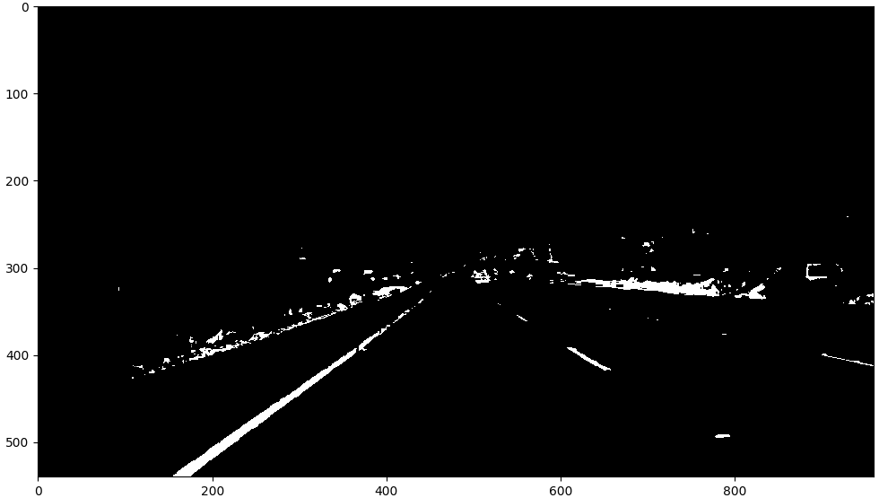
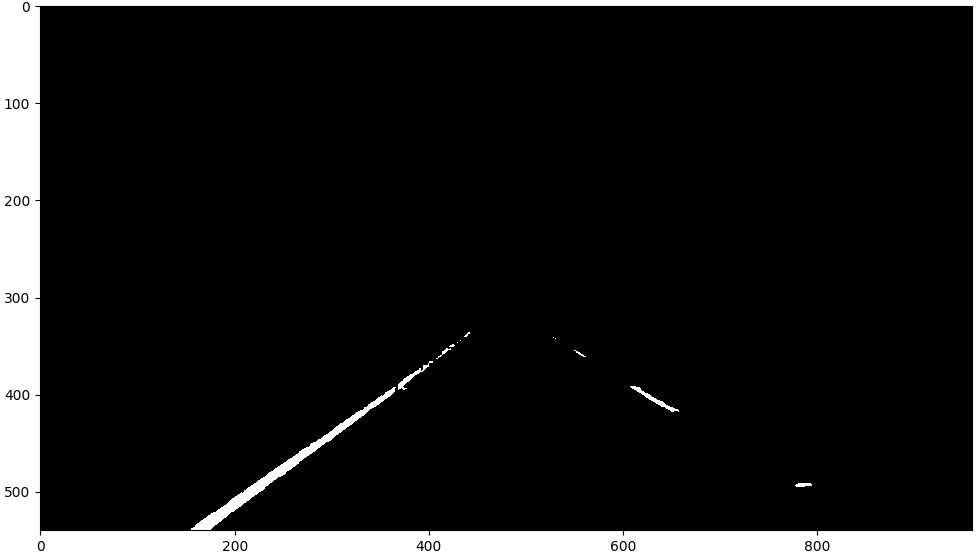
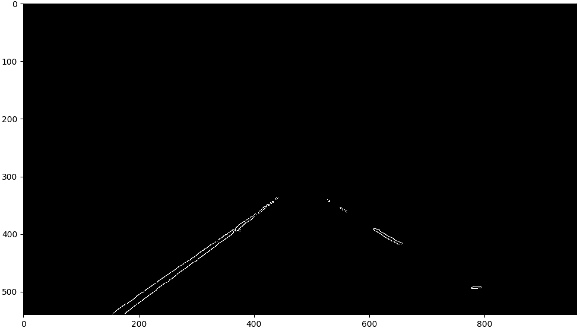
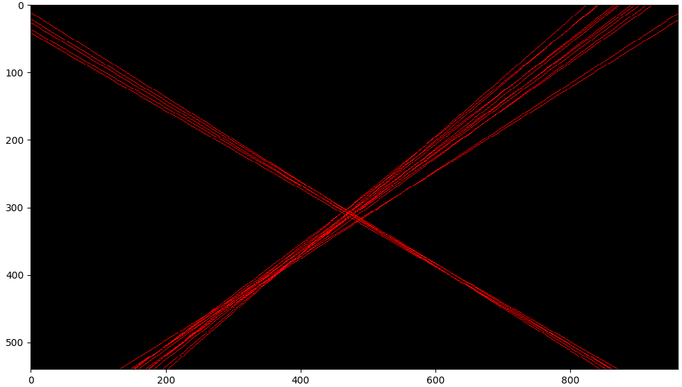
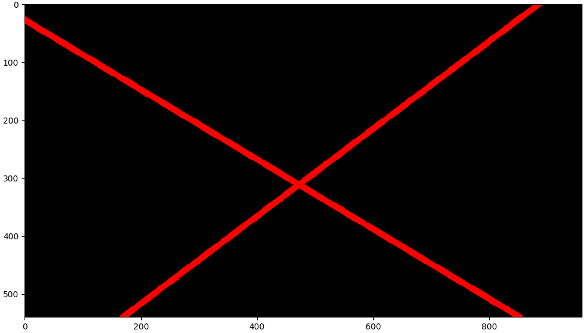
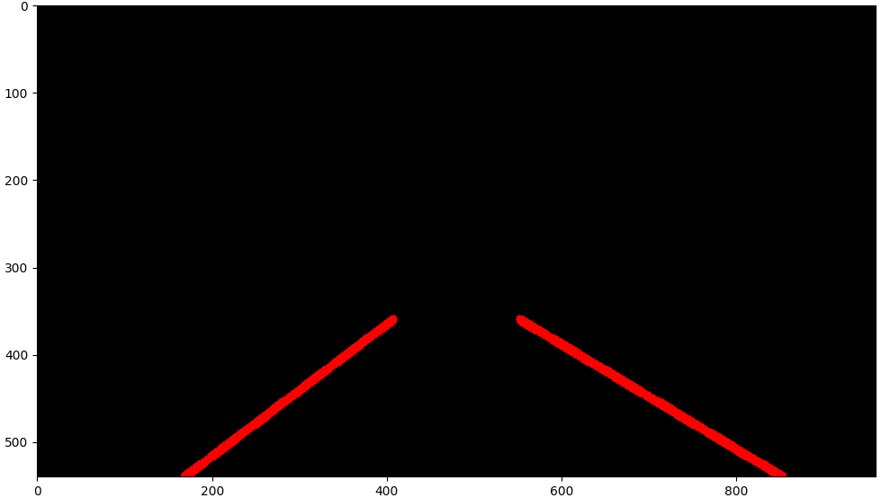

#**Finding Lane Lines on the Road**

Overview
---

When we drive, we use our eyes to decide where to go.  The lines on the road that show us where the lanes are act as our constant reference for where to steer the vehicle.  Naturally, one of the first things we would like to do in developing a self-driving car is to automatically detect lane lines using an algorithm.

Project Writeup
---

Programm has image processing pipeline that support both RGB images and BGR video input.

    RGB image processing consists of next steps:
        - image file reading. File expected to exist on disk
        - RGB to BGR conversion
        - common image processing pipeline
        - processing result conversion (BGR to RGB)
        - result image output
    BGR video processing consists of next steps:
        - video file capturing. File expected to exist on disk
        - video frame processing loop:
            * common image processing pipeline
            * result frame output
        - resources release

    Image processing pipeline does:
        - BGR to HSV conversion
        - white and yellow colors filter, creates b/w image. Makes other colored objects black
        - detection area filter. Creates new b/w image output of color filter result
        - edge detection
        - lines detection with help of Hough transform method (cv2.HoughLines tool)
        - lanes detection with help of custom algorithm that does line groups detection and median line
          calculation for each found group
        - lane lines Polar coortinate to Cartesian coordinate conversion, drawing lane lines
        - result image composition from initial frame and detected lane lines images
        - result image returned to program for output/further operations

Colors detection on HSV image allows efficientely get rid of noise coused by shadows and road surface color artifacts. Further b/w image processing might save processor time.

Image processing pipeline in pictures:

<ul>
    <li>
        
White and yellow colors filter resul

        

    </li>
    <li>
        
Detection area filter result

        

    </li>
    <li>
        
Edge detection result

        

    </li>
    <li>
        
Transformed into image cv2.HoughLines output

        

    </li>
    <li>
        
Transformed into image lines filtering and grouping with resulting line algorithm output

        

    </li>
    <li>
        
Polar coortinate to Cartesian coordinate conversion, drawing

        

    </li>
    <li>
        
Program output

        

    </li>
</ul>

As the next improvement I would extract configuration parametes into separate entity. And would use same instance of it for on-flight configuration/adjustment. It can become an interface for another system :)

